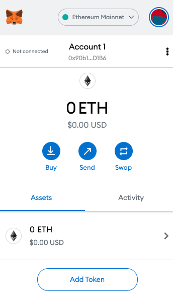
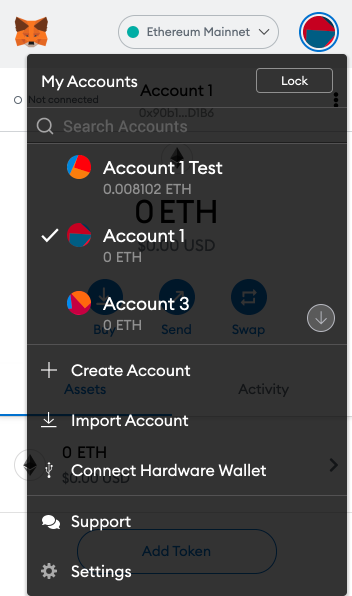
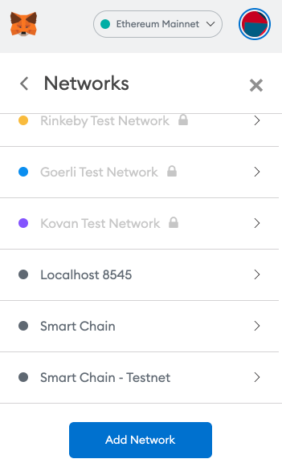

# 📚 Configuring MetaMask

MetaMask wallet has shown to be effective for decentralized finance (DeFi) applications, especially for use on the Binance Smart Chain.

### Installing MetaMask Wallet&#x20;

You can install MetaMask on Chrome and Firefox, or on IOS and Android if you’re a mobile user. The first thing you need to do is head over to the MetaMask [download page](https://metamask.io/download) and select the whichever platform you’re using. Then, follow the instructions to install it on your device. It is quite easy.&#x20;

The next step is to follow along with the setup specified by the app. Go ahead and click Create a Wallet. Make sure you write down your seed phrase somewhere secret. Ideally, it should not be on the Internet-connected device.&#x20;

Confirm that you have written your seed phrase down on the next page. Now, you’re good to go and your wallet is set up to receive and send funds.

### Connecting MetaMask to BSC Network

When you open your MetaMask wallet, you might notice that you’re still dealing with an Ethereum wallet. AT best, it will not work with Binance Smart Chain DApps. At worst, you can lose all your funds by sending them to addresses you cannot actually use. In order to change that, you need to follow a few easy steps depicted below.

**Step 1: Open your MetaMask wallet and go to **<mark style="background-color:blue;">**Settings**</mark>

**Step 2: Select “Networks” and click the **<mark style="background-color:blue;">**Add Network**</mark>** button.**

****

**Step 3: Input the following information.**

****

* Network Name: Smart Chain
* New RPC URL: https://bsc-dataseed.binance.org/
* ChainID: 56
* Symbol: BNB
* Block Explorer URL: [**https://bscscan.com**](https://bscscan.com)

**Step 4: Select the newly added BSC network and you will be connected to the BSC network.**

**tep 5: Connect your wallet to SharkStake using the built-in-Web3 integration.**

<mark style="background-color:yellow;"></mark>

****

****

