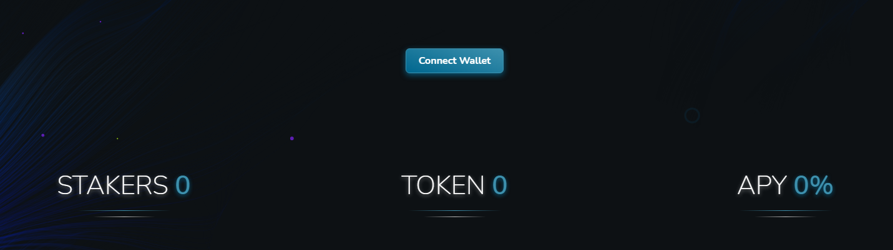

# ✅ Connecting Your Wallet to SharkStake

Once you’ve connected your wallet to the BSC network, head over to the SharkStake homepage and click the _**Connect Wallet**_ button.

Before you connect, make sure you have switched from the **Ethereum Mainnet** network to the **Binance Smart Chain**.

Once these steps are done, you will be able to enjoy all the options of the platform.

