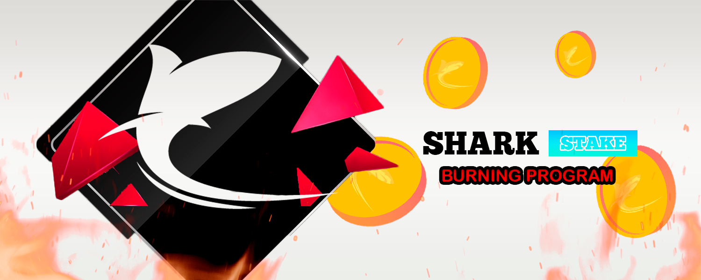

# 🚀 Burning Program

In SharkStake we will implement a token burning program, which will provide a constant and consistent increase in token value.&#x20;

The burning will be done gradually and always looking for the benefit of the investor as well as an attraction for new investors. We know that token burning is a positive thing, especially when it is done in a gradual way, as it increases the value and the staking rewards get a higher value.

Each burning will consist of 1m tokens burnt every month for the next two years. After this time the burnings will come to a halt for a while and will return with a lower amount of burnt tokens

****

