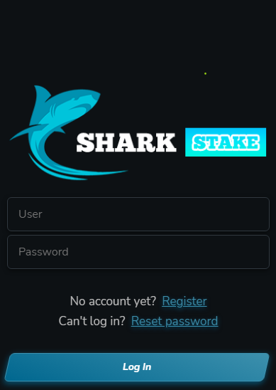

# 🧬 SharkSwap

The goal of SharkSwap is to provide a place to trade your crypto portfolio safely under decentralized terms.

SharkSwap will incentivize the use of our native token, SharkStake, and will also allow our users to stake their tokens safely. As we dedicate a lot of work to the SharkStake ecosystem and it keeps growing, we will bring more and more projects and parties interested in the SharkSwap app.

&#x20;

SharkSwap will have an order system so that users can choose the buy and sell price of all tradable tokens on the BSC network without the need to do it manually and the so long waited stop loss option. We will be pioneers to offer both options within the BSC ecosystem.
